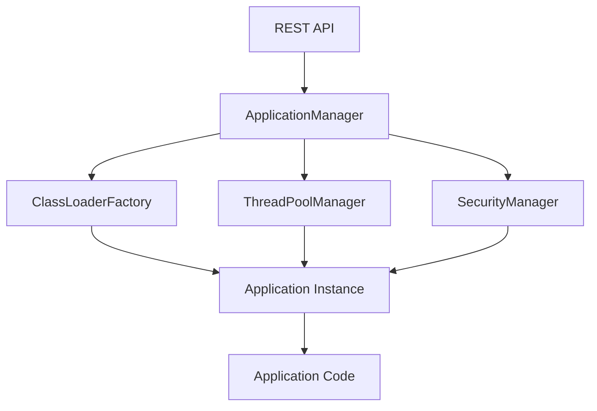

# FlossWare Platform Architecture

This document provides a comprehensive overview of the FlossWare Platform architecture, design decisions, and system components.

## Table of Contents

- [Overview](#overview)
- [Core Concepts](#core-concepts)
- [System Architecture](#system-architecture)
- [Module Organization](#module-organization)
- [Security Architecture](#security-architecture)
- [Deployment Models](#deployment-models)
- [Design Patterns](#design-patterns)
- [Extension Points](#extension-points)

---

## Overview

The FlossWare Platform is a multi-tenant Java application platform that enables running multiple isolated applications within a single JVM process. It provides isolation, resource management, and orchestration capabilities comparable to container platforms, but at the JVM level.

### Design Philosophy

1. **Isolation First** - Applications must not interfere with each other
2. **Secure by Default** - Security features enabled out-of-the-box
3. **Extensible Architecture** - Plugin-based design for customization
4. **Production Ready** - Enterprise-grade reliability and monitoring
5. **Developer Friendly** - Clear APIs and comprehensive documentation

### Key Capabilities

- **ClassLoader Isolation** - Separate classpaths per application
- **Thread Pool Isolation** - Configurable thread limits per application
- **Resource Management** - CPU, memory, and thread enforcement
- **Hot Code Reload** - Zero-downtime application updates
- **Multiple Deployment Modes** - In-JVM, containers, native processes
- **Comprehensive Security** - Authentication, authorization, input validation

---

## Core Concepts

### Application

An **Application** is the basic unit of deployment. Each application:
- Has a unique application ID
- Runs in an isolated ClassLoader
- Has dedicated thread pool resources
- Can optionally expose services to other applications

```java
public interface Application {
  void start() throws Exception;
  void stop() throws Exception;
}
```

### Application Descriptor

An **ApplicationDescriptor** defines application metadata and configuration:

```yaml
applicationId: my-app
name: My Application
version: 1.0.0
mainClass: com.example.MyApp
classpathEntries:
  - /path/to/app.jar
  - /path/to/lib/*
properties:
  database.url: ${DATABASE_URL}
  api.key: ${API_KEY}
threadPoolConfig:
  coreSize: 10
  maxSize: 50
resourceConfig:
  maxMemoryMB: 512
  maxCpuPercent: 50
securityConfig:
  permissions:
    - java.io.FilePermission "/tmp/*" "read,write"
```

### Isolation Boundaries

The platform enforces multiple isolation boundaries:

1. **ClassLoader Isolation**
   - Each application has its own URLClassLoader
   - Parent-first or child-first delegation configurable
   - Prevents class version conflicts

2. **Thread Isolation**
   - Per-application thread pools
   - Configurable min/max thread counts
   - Thread leak detection

3. **Security Isolation**
   - Per-application security policies
   - SecurityManager enforcement (optional)
   - Custom permissions per application

4. **Resource Isolation**
   - CPU usage limits (via thread scheduling)
   - Memory limits (monitoring + enforcement)
   - File descriptor limits

---

## System Architecture

### High-Level Architecture

```
┌─────────────────────────────────────────────────────────┐
│                    Management Layer                      │
│  REST API │ Web Console │ CLI │ Desktop UI │ Terminal   │
└────────────────────┬────────────────────────────────────┘
                     │
┌────────────────────┴────────────────────────────────────┐
│              Platform Core Services                      │
│  ┌──────────────┐  ┌──────────────┐  ┌──────────────┐ │
│  │ Application  │  │   Resource   │  │  Security    │ │
│  │  Manager     │  │   Monitor    │  │  Manager     │ │
│  └──────────────┘  └──────────────┘  └──────────────┘ │
│  ┌──────────────┐  ┌──────────────┐  ┌──────────────┐ │
│  │  ClassLoader │  │  ThreadPool  │  │   Message    │ │
│  │   Manager    │  │   Manager    │  │     Bus      │ │
│  └──────────────┘  └──────────────┘  └──────────────┘ │
└─────────────────────────────────────────────────────────┘
                     │
┌────────────────────┴────────────────────────────────────┐
│                 Application Layer                        │
│  ┌──────────────┐  ┌──────────────┐  ┌──────────────┐ │
│  │ Application  │  │ Application  │  │ Application  │ │
│  │      A       │  │      B       │  │      C       │ │
│  │              │  │              │  │              │ │
│  │ Isolated     │  │ Isolated     │  │ Isolated     │ │
│  │ ClassLoader  │  │ ClassLoader  │  │ ClassLoader  │ │
│  │ ThreadPool   │  │ ThreadPool   │  │ ThreadPool   │ │
│  └──────────────┘  └──────────────┘  └──────────────┘ │
└─────────────────────────────────────────────────────────┘
```

### Component Interaction



### Data Flow

**Deployment Flow**:
1. Client submits ApplicationDescriptor (REST API, file watcher, CLI)
2. ApplicationManager validates descriptor
3. SecurityManager validates permissions
4. ClassLoaderFactory creates isolated ClassLoader
5. ThreadPoolManager creates dedicated thread pool
6. Application.start() called in isolated context
7. ResourceMonitor begins tracking

**Request Flow** (for applications with HTTP endpoints):
1. External request arrives at platform API
2. Router identifies target application
3. Request forwarded to application's HTTP handler
4. Application processes in isolated thread pool
5. Response returned through platform API

---

## Module Organization

The platform is organized into focused, cohesive modules:

### Core Modules

| Module | Purpose | Dependencies |
|--------|---------|--------------|
| `platform-api` | Core interfaces and contracts | None |
| `platform-core` | Application lifecycle management | platform-api |
| `platform-classloader` | ClassLoader isolation | platform-api |
| `platform-threadpool` | Thread pool management | platform-api |
| `platform-security` | Security and permissions | platform-api |
| `platform-monitoring` | Resource monitoring | platform-api |

### Management Modules

| Module | Purpose |
|--------|---------|
| `platform-rest-api` | HTTP REST API server |
| `platform-rest-api-netty` | Netty-based REST API (TLS support) |
| `platform-web-console` | Web-based management UI |
| `platform-swing-ui` | Desktop management application |
| `platform-terminal-ui` | Terminal-based UI (curses-like) |

### Integration Modules

| Module | Purpose |
|--------|---------|
| `platform-messaging` | Message bus abstraction |
| `platform-messaging-jms` | JMS message bus implementation |
| `platform-storage` | Storage volume management |
| `platform-storage-s3` | S3-backed storage |
| `platform-storage-database` | Database-backed storage |

### Configuration Modules

| Module | Purpose |
|--------|---------|
| `platform-config` | Configuration management |
| `platform-config-vault` | HashiCorp Vault integration |
| `platform-config-etcd` | etcd configuration backend |
| `platform-config-consul` | Consul configuration backend |
| `platform-config-zookeeper` | ZooKeeper configuration backend |

### Clustering Modules

| Module | Purpose |
|--------|---------|
| `platform-cluster` | Clustering abstraction |
| `platform-cluster-consul` | Consul-based clustering |
| `platform-cluster-etcd` | etcd-based clustering |
| `platform-cluster-redis` | Redis-based clustering |
| `platform-cluster-zookeeper` | ZooKeeper-based clustering |

---

## Security Architecture

### Defense in Depth

The platform implements multiple security layers:

1. **Input Validation** (Entry Point)
   - Path traversal prevention
   - Input sanitization
   - Type validation

2. **Authentication & Authorization** (Access Control)
   - API key authentication
   - Role-based access control (RBAC)
   - Per-application permissions

3. **Isolation** (Runtime)
   - ClassLoader boundaries
   - SecurityManager policies
   - Thread pool separation

4. **Monitoring & Auditing** (Detection)
   - Security event logging
   - Audit trail
   - Anomaly detection

5. **Encryption** (Data Protection)
   - TLS for API traffic
   - Encrypted storage volumes
   - Secrets management

### Security Components

```
┌─────────────────────────────────────────────────────┐
│                 Security Layer                       │
├─────────────────────────────────────────────────────┤
│                                                      │
│  ┌────────────────┐      ┌────────────────┐        │
│  │   API Auth     │      │   CORS Policy  │        │
│  │  (X-API-Key)   │      │  (Whitelist)   │        │
│  └────────────────┘      └────────────────┘        │
│                                                      │
│  ┌────────────────┐      ┌────────────────┐        │
│  │ Input          │      │  Path          │        │
│  │ Validation     │      │  Validation    │        │
│  └────────────────┘      └────────────────┘        │
│                                                      │
│  ┌────────────────┐      ┌────────────────┐        │
│  │ Secrets        │      │  Log           │        │
│  │ Management     │      │  Masking       │        │
│  └────────────────┘      └────────────────┘        │
│                                                      │
│  ┌─────────────────────────────────────────┐       │
│  │        Security Audit Log               │       │
│  └─────────────────────────────────────────┘       │
└─────────────────────────────────────────────────────┘
```

### Threat Model

| Threat | Mitigation |
|--------|------------|
| **Path Traversal** | Input validation, path normalization |
| **XSS/CSRF** | CORS policy, HTTPS-only |
| **Credential Exposure** | Environment variables, log masking |
| **Dependency Vulnerabilities** | OWASP dependency scanning |
| **Resource Exhaustion** | Thread limits, memory limits |
| **Unauthorized Access** | API key authentication, RBAC |

---

## Deployment Models

The platform supports three deployment modes:

### 1. In-JVM Deployment (Default)

Applications run as isolated ClassLoaders within the platform JVM:

```
┌──────────────────────────────────────┐
│         Platform JVM                 │
│  ┌────────────┐  ┌────────────┐    │
│  │ App A      │  │ App B      │    │
│  │ ClassLoader│  │ ClassLoader│    │
│  └────────────┘  └────────────┘    │
└──────────────────────────────────────┘
```

**Pros**: Fastest, lowest overhead, shared JVM heap  
**Cons**: JVM crash affects all apps

### 2. Native Process Execution

GraalVM native images run as separate OS processes:

```
┌──────────────────────────────────────┐
│         Platform JVM                 │
│  (Manages)                           │
└────────┬─────────────────────────────┘
         │
         ├─→ Process: App A (native)
         ├─→ Process: App B (native)
         └─→ Process: App C (native)
```

**Pros**: Process isolation, faster startup, lower memory  
**Cons**: No shared heap, inter-process communication overhead

### 3. Container Deployment

Applications run in Docker/Podman containers:

```
┌──────────────────────────────────────┐
│         Platform JVM                 │
│  (Orchestrates)                      │
└────────┬─────────────────────────────┘
         │
         ├─→ Container: App A
         ├─→ Container: App B
         └─→ Container: App C
```

**Pros**: Strong isolation, portable, industry standard  
**Cons**: Highest overhead, requires container runtime

---

## Design Patterns

### Factory Pattern

Used for creating isolated ClassLoaders:

```java
public interface ClassLoaderFactory {
  ClassLoader create(ApplicationDescriptor descriptor);
}
```

### Builder Pattern

Used for configuration objects:

```java
ApplicationDescriptor descriptor = ApplicationDescriptor.builder()
  .applicationId("my-app")
  .mainClass("com.example.App")
  .property("key", "${ENV_VAR}")
  .build();
```

### Observer Pattern

Used for lifecycle events:

```java
public interface ApplicationLifecycleListener {
  void onDeployed(String appId);
  void onStarted(String appId);
  void onStopped(String appId);
  void onUndeployed(String appId);
}
```

### Strategy Pattern

Used for pluggable components:

```java
public interface MessageBus {
  void publish(String topic, Object message);
  void subscribe(String topic, Consumer<Object> handler);
}
```

### Singleton Pattern

Used for platform-wide managers:

```java
public class ApplicationManager {
  private static final ApplicationManager INSTANCE = new ApplicationManager();
  
  public static ApplicationManager getInstance() {
    return INSTANCE;
  }
}
```

---

## Extension Points

The platform provides several extension points for customization:

### 1. Custom Application Types

Implement the `Application` interface:

```java
public class MyApplication implements Application {
  @Override
  public void start() throws Exception {
    // Custom startup logic
  }
  
  @Override
  public void stop() throws Exception {
    // Custom shutdown logic
  }
}
```

### 2. Custom Message Bus

Implement the `MessageBus` interface:

```java
public class KafkaMessageBus implements MessageBus {
  @Override
  public void publish(String topic, Object message) {
    // Kafka publishing logic
  }
  
  @Override
  public void subscribe(String topic, Consumer<Object> handler) {
    // Kafka subscription logic
  }
}
```

### 3. Custom Storage Backend

Implement the `StorageProvider` interface:

```java
public class S3StorageProvider implements StorageProvider {
  @Override
  public InputStream read(String path) throws IOException {
    // S3 read logic
  }
  
  @Override
  public void write(String path, InputStream data) throws IOException {
    // S3 write logic
  }
}
```

### 4. Custom Configuration Source

Implement the `ConfigSource` interface:

```java
public class VaultConfigSource implements ConfigSource {
  @Override
  public String get(String key) {
    // Vault lookup logic
  }
}
```

### 5. Custom Lifecycle Listeners

Register lifecycle listeners:

```java
public class MyLifecycleListener implements ApplicationLifecycleListener {
  @Override
  public void onDeployed(String appId) {
    // Send notification, log event, etc.
  }
}

applicationManager.addLifecycleListener(new MyLifecycleListener());
```

---

## Performance Considerations

### Memory Management

- **Heap Isolation**: Not enforced at JVM level, monitored via JMX
- **ClassLoader Leaks**: Prevented by clearing ThreadLocal references
- **Thread Leaks**: Detected and reported during shutdown

### Thread Management

- **Pool Sizing**: Default formula: `cores * 2` for CPU-bound, `cores * 4` for I/O-bound
- **Queue Bounds**: Bounded queues prevent memory exhaustion
- **Thread Naming**: Threads tagged with application ID for debugging

### Resource Monitoring

- **Sampling Rate**: Default 5 seconds (configurable)
- **Metric Retention**: In-memory rolling window (last hour)
- **Metric Export**: JMX, Prometheus, custom exporters

---

## Scalability

### Vertical Scaling

- **JVM Heap**: Configure `-Xmx` based on total application memory needs
- **Thread Pools**: Size based on workload characteristics
- **File Descriptors**: Increase OS limits for many applications

### Horizontal Scaling

- **Clustering**: Multiple platform instances with shared state (etcd, Consul)
- **Load Balancing**: Distribute applications across instances
- **Service Discovery**: Automatic registration and discovery

---

## Operational Concerns

### Deployment

1. **Build**: `mvn clean package`
2. **Distribution**: Single JAR or Docker image
3. **Configuration**: Environment variables or external config
4. **Startup**: `java -jar platform-launcher.jar`

### Monitoring

- **Health Checks**: `/health` endpoint
- **Metrics**: Prometheus `/metrics` endpoint
- **Logs**: Structured logging with masked sensitive data
- **Audit Trail**: Separate audit log for security events

### Troubleshooting

- **Thread Dumps**: `jstack <pid>` or JMX
- **Heap Dumps**: `jmap -dump:format=b,file=heap.bin <pid>`
- **GC Logs**: `-Xlog:gc*:file=gc.log`
- **Application Logs**: Per-application log files

---

## Future Architecture

### Planned Enhancements

1. **Native TLS Support** - Built-in HTTPS without reverse proxy
2. **Advanced Scheduling** - Intelligent workload placement
3. **Auto-scaling** - Dynamic resource allocation
4. **Service Mesh** - Advanced inter-application communication
5. **Multi-Region** - Geographic distribution support

---

## References

- [README.md](README.md) - Getting started guide
- [CONTRIBUTING.md](CONTRIBUTING.md) - Development guidelines
- [SECURITY.md](TLS_DEPLOYMENT.md) - Security documentation
- [TESTING.md](TESTING.md) - Testing guide

---

**Last Updated**: 2026-05-29  
**Version**: 1.1  
**Maintainer**: FlossWare Team
